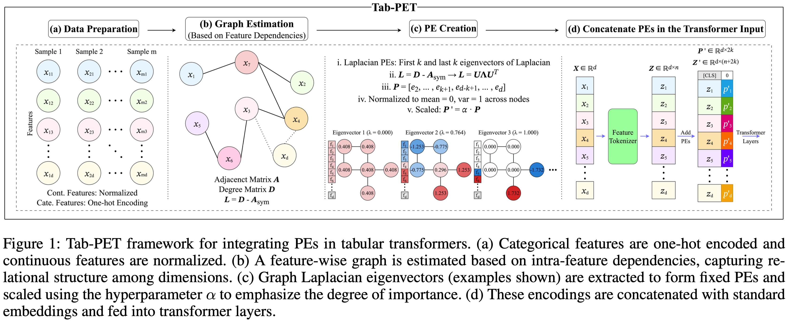

# Tab-PET: Graph-Based Positional Encodings for Tabular Transformers

[AAAI-26] Official implementation of Tab-PET: Graph-Based Positional Encodings for Tabular Transformers.



## TL;DR

Supervised learning with tabular data presents unique challenges: low data sizes, absence of structural cues, and heterogeneous features. Unlike vision and language tasks where models exploit inductive biases, tabular data lacks inherent positional structure. **Tab-PET** addresses this by introducing a graph-based framework for estimating and integrating positional encodings (PEs) into transformer-based architectures for tabular data.

**Key Findings:**

- Graph-derived PEs significantly improve transformer performance on tabular data
- PEs reduce the effective rank of embeddings, simplifying the learning task
- Association-based graphs (especially Spearman correlation) consistently outperform causality-based approaches
- Validated on 50 classification and regression datasets with consistent improvements

## Installation

### Requirements

```bash
# Clone the repository
git clone https://github.com/yunzeleng/tabpet.git
cd tabpet

# Create conda environment
conda env create -f environment.yml
```

### Key Dependencies

- `PyTorch` >= 1.9.0
- `scikit-learn` >= 1.6.0
- `pandas` >= 2.3.0
- `numpy` >= 1.26.0
- `scipy` >= 1.11.0
- `lingam` >= 1.10.0

For full package list, see `environment.yml`.

## Quick Start

```bash
cd ./tabpet/ft-transformer_with_tabpet
python main.py cmc 1 --method spearman --gpu_id 0 --pe_alphas 0 1
```

This command:

- Uses the `cmc` dataset (version 1) from OpenML
- Applies Spearman correlation for graph estimation
- Compares vanilla FT-Transformer baseline (α=0) with Tab-PET (α=1)

## Detailed Usage

Basic Command Structure

```bash
python main.py <dataset_name> <dataset_version> [options]
```

### 1. FT-Transformer with Tab-PET (Recommended)

```bash
cd ./tabpet/ft-transformer_with_tabpet

# Basic usage
python main.py <dataset_name> <dataset_version> [options]

# Example: Test multiple alpha values
python main.py steel-plates-fault 3 \
    --method spearman \
    --pe_alphas 0 0.1 0.5 1.0 2.0 \

# Example: Try different graph estimation approaches
python main.py blood-transfusion-service-center 1 \
    --method pearson \
    --gpu_id 0
    
# Example: Custom configuration
python main.py california 4 \
    --num_epochs 200 \
    --batch_size 128 \
    --seeds 1 2 3 \
```

The provided code gives a comparison between:

1. FT-Transformer Baseline: Standard FT-Transformer without PEs (α=0)
2. FT-Transformer + Tab-PET: Enhanced with graph-derived PEs (α>0)

### 2. SAINT with Tab-PET

```bash
cd ./tabpet/saint_with_tabpet

# Basic usage
python main.py <dataset_name> <dataset_version> [options]
```

### 3. TabTransformer with Tab-PET

**Note**: TabTransformer only applies embeddings to categorical features. For datasets with multiple categorical variables:

```bash
cd ./tabpet/tabtransformer_with_tabpet

# Example with categorical-heavy dataset
python main.py <dataset_name> <dataset_version> \
    --method spearman \
    --gpu_id 0
```

## Command-Line Arguments

### Required Arguments

- `dataset_name`: OpenML dataset name (e.g., "cmc", "california", "blood-transfusion")
- `dataset_version`: OpenML dataset version number (e.g., 1, 4)

### Optional Arguments

| Argument           | Type    | Default                                   | Description                  |
| ------------------ | ------- | ----------------------------------------- | ---------------------------- |
| `--method`         | str     | `spearman`                                | Graph estimation approach    |
| `--gpu_id`         | int     | `1`                                       | GPU device ID                |
| `--pe_alphas`      | float[] | `0 0.05 0.1 0.2 0.5 0.7 1.0 2.0 5.0 10.0` | PE scaling factors to test   |
| `--seeds`          | int[]   | `1 2 3 4 5`                               | Random seeds for experiments |
| `--num_epochs`     | int     | `500`                                     | Maximum training epochs      |
| `--early_stopping` | bool    | `True`                                    | Enable early stopping        |
| `--batch_size`     | int     | `32`                                      | Training batch size          |

### Graph Estimation Approaches (`--method`)

| Approach     | Type        | Properties                              | Avg. Time (min) |
| ------------ | ----------- | --------------------------------------- | --------------- |
| `spearman` * | Association | Nonlinear                               | 0.79            |
| `pearson`    | Association | -                                       | 0.78            |
| `chowliu`    | Association | Tree-based, Directed Acyclic, Nonlinear | 0.38            |
| `lingam`     | Causal      | Directed Acyclic                        | 10.96           |
| `notears`    | Causal      | Directed Acyclic                        | 76.83           |

$^*$ Use `spearman` for optimal balance of performance and efficiency.

## Key Hyperparameters

### PE Scaling Factor (α)

The hyperparameter **α** controls the influence of positional encodings:

- α = 0: Vanilla transformer (no PEs)
- α ∈ (0, 1]: Moderate PE influence
- α > 1: Strong PE influence (use with caution, may overshadow content (e.g., α > 10 ))

**Automatic Selection**: Our framework uses greedy validation-based selection from the specified `--pe_alphas` range.

## Instructions for Reproducibility

To reproduce the main results from Table 2 in the paper:

```bash
# FT-Transformer/SAINT/TabTransformer + Tab-PET (Spearman) on all 50 datasets
cd ./tabpet/<vanilla_transformer_name>_with_tabpet

# Run on all classification and regression datasets
python main.py <dataset_name> <version> --method spearman

# Run on all regression datasets  
python main.py <dataset_name> <version> --method spearman
```

For detailed fairness of comparison, please refer to technical appendix F.3.